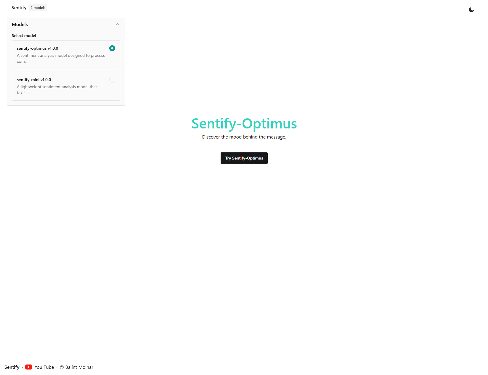

# Sentify &middot; Natural Language Proccessing 

Sentiment analysis, also known as opinion mining, is a natural language processing technique used to determine the emotional tone of text.
It identifies whether a given text expresses a positive, negative, or neutral sentiment.
Businesses often use sentiment analysis to understand customer opinions from reviews, surveys, and social media posts.
Advanced sentiment analysis models, like those based on BERT, can handle nuanced expressions and work across multiple languages.
The process involves preprocessing text, converting it into a format suitable for machine learning models, and classifying the sentiment using statistical or deep learning techniques.

## 1. Sentify-Optimus
The `lptown/bert-base-multilingual-uncased-sentiment` is a pre-trained BERT-based model designed for multilingual sentiment analysis. It can identify the emotional tone of text (positive, neutral, or negative) across various languages.
### Features
- **Multilingual Support:** The model supports multiple languages, making it ideal for global applications.
- **Uncased Version:** It is case-insensitive, simplifying text preprocessing.
- **Sentiment Classes:** The model predicts three sentiment classes:
    - Very positive
    - Positive
    - Neutral
    - Negative
    - Very negative

### Usage
The model can be easily integrated with the Hugging Face `transformers` library.

## 2. Sentify-Mini

This sentiment analysis model is a deep learning architecture designed to classify text into positive or negative sentiment categories. It was trained on the IMDB Reviews dataset, a widely used benchmark for binary sentiment classification. The model uses an embedding layer to represent words as dense vectors, capturing semantic relationships.

It incorporates two Bidirectional LSTM layers to capture both forward and backward context in the text, enabling the model to understand sequential dependencies. A dense layer with ReLU activation provides a nonlinear transformation, while dropout helps prevent overfitting. Finally, a sigmoid activation function in the output layer is used to predict the probability
of a positive sentiment. The model is compiled with the Adam optimizer and binary cross-entropy loss to effectively handle the binary classification task.

## 3. Tech-Stack
| Technology   | Usage                          |
|--------------|--------------------------------|
| React        | Front-end development, UI      |
| Flask        | Back-end development, API      |
| TensorFlow   | Machine learning framework     |
| Keras        | High-level neural networks API |
| Transformers | Pre-trained models, NLP tasks  |

## 4. Previews

